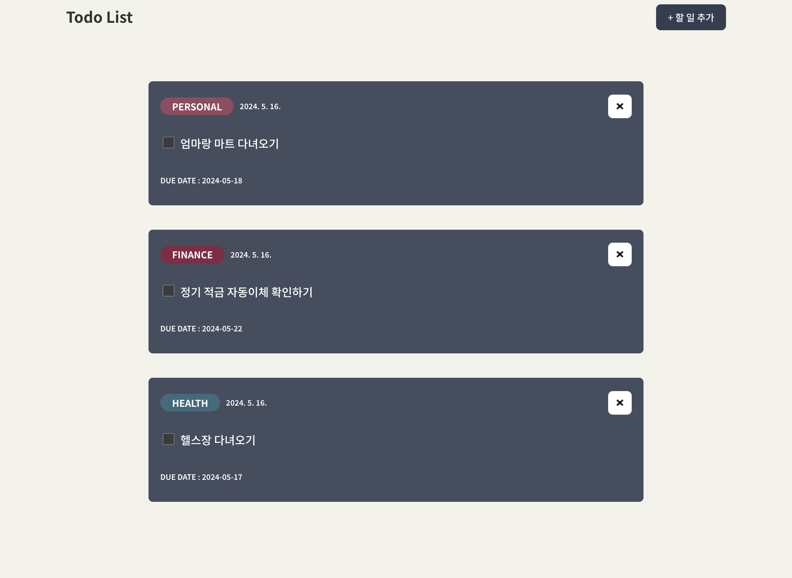
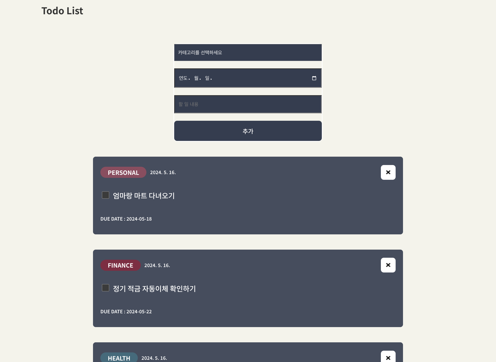
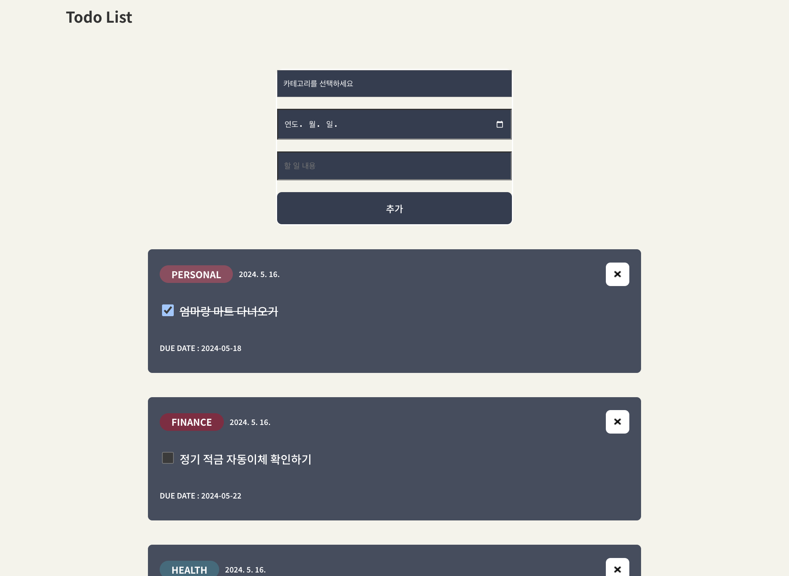

# [TIL] - 과제 제출, 피드백 사항 수정, 딥다이브 스터디

## ✅ 공부한 내용

### ✔️ [딥다이브 스터디](https://github.com/hyeonseok98/js-deep-dive-study/blob/main/%5B10%EC%9E%A5%5D%20%EA%B0%9D%EC%B2%B4%20%EB%A6%AC%ED%84%B0%EB%9F%B4/%EA%B5%AD%EB%AF%BC%EC%98%81.md)

## ✅ 개발 단계 정리





### 투두리스트 프로젝트 완성과 수정사항 반영!

### 프로젝트 설정 및 구조화:

- 프로젝트를 초기화하고 필요한 파일 및 폴더를 생성
- 컴포넌트를 구성할 디렉토리 구조를 설계

### 컴포넌트 개발:

- Todo 항목을 표시하는 TodoList 컴포넌트를 개발
- Todo 입력을 받는 InputForm 컴포넌트를 개발 -전반적인 레이아웃을 담당하는 Layout 컴포넌트를 개발

### 상태(State) 및 이벤트 처리:

- Todo 항목의 상태를 관리하기 위한 상태(state)와 관련된 이벤트 처리 로직을 작성
- Todo 추가, 삭제, 완료 여부 토글 등의 기능을 구현

### 스타일링 및 디자인:

- 각 컴포넌트에 필요한 스타일링을 스타일드 컴포넌트를 사용하여 적용

## ✅ 문제 해결

styled-components props를 전달할때 Badge 에러가 발생하였다.

React는 camelCase로 DOM 속성을 인식하고,
Badge는 정의 되지 않는 DOM 속성이기 때문에 경고가 뜨게 된것이다

lowercase로 작성해도 해결 되지만, 그렇게 해결하고 싶지는 않아서 튜터님에게도 물어보고 구글링도 해보니 transient props를 이용하여 해결할 수 있는데,

```jsx
const Badge = styled.p`
  margin: 0;
  padding: 5px 20px;
  height: 20px;
  display: flex;
  align-items: center;
  justify-content: center;
  border-radius: 210px;
  font-weight: bold;
  background-color: ${({ $badgeColor }) => $badgeColor || "#934A5F"};
  margin-right: 10px;
`;

<Badge $badgeColor={badgeColor}>{todo.category}</Badge>
```

$를 prop 앞에 추가해주었더니 해결되었다
