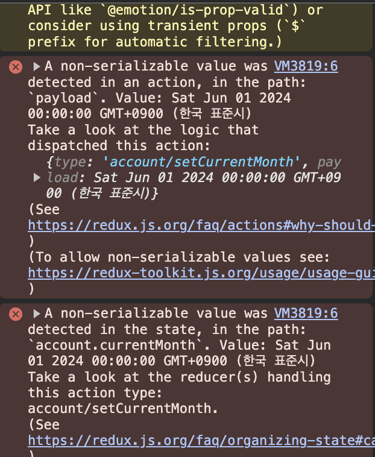

# [TIL] - 지출 관리 과제 1차 제출, 분반 수업, 딥 다이브 스터디

## ✅ 공부한 내용

### 복습

#### 1. 리렌더링의 조건

- state값의 변경
- props의 변경
- 부모의 변경 (=> use.memo를 사용하여 방지 가능)

#### 2. React Router

##### 2-1. 리액트 라우터란?

**React에서 페이지 라우팅을 구현하기 위한 표준 라이브러리**
SPA에서 여러 페이지를 효과적으로 관리할 수 있도록 도움

> **라우팅?**
> 어떤 경로에 대하여 무엇을 해줄지 맵핑해주는 것

##### 2-2. BrowserRouter

- React는 Web환경 이외에 Native 환경에서도 사용 가능
- Web 환경에서는 React Router의 BrowserRouter를 사용해서 라우팅 시스템 구현

##### 2-3. Link Component

- a 태그가 아닌 `<Link />`태그 사용

##### 2-4. 정적 라우팅 & 동적 라우팅

- 정적 라우팅: 애플리케이션 각 페이지를 Route컴포넌트 사용
- 동적 라우팅: Route 컴포넌트의 path의 prop : 를 사용하여 변수를 포함시키면 (예: id)동적 라우팅을 구현 / useParams, useLocation 훅을 사용하여 URL 파라미터나 쿼리에 접근!

#### 3. Redux

**전역 상태 관리 - Global State Management : 앱 전체에 걸쳐 상태를 공유하고 관리 하는 것**

- 전역 상태 관리하는 방법
  1. props drilling
  2. 라이브러리(Redux, Zustand, Recoil, React Query 등..)
  - Redux에 전세계 개발자들 열광
  - 하지만 곧 단점을 많이 느낌
    - 단점 극복을 위한 노력
      1. Recoil, Zustand: 복잡합을 극복하기 위함 / 쉽게 쓸 수 있도록 개선, 개량
      2. React Query: 클라이언트 상태 관리에서 비동기 통신 작업이 쉽지 않고(작성해야 할 코드의 양이 너무 많고) 서버 상태와 실시간 동기화가 어렵다는 단점을 개선, 개량하기 위함
  3. Context API
  - 리액트 라이브러리만으로 전역 상태 관리가 가능하도록 추가된 API

##### 3-1. 특징

1. 단방향 데이터 흐름(flux 아키텍처)
2. 의도된 복잡함(까다로움) → 데이터를 엄격하게 변경하기 위한(predictable and maintainable) 까다로운 구조
3. 배우기 조금 까다로움
   → 개념과 용어가 많음
   → 기본적으로 작성해야하는 코드의 양이 많음

##### 3-2. 핵심 개념

- Redux는 상태를 저장하고 불러오고 변화시킬 수 있는 곳
- 따라서 저장소가 있고, 저장소 내 값에 대한 CRUD가 전부
- 저장소는 store, 저장소 내 값에 대한 CUD처리는 reducer를 통해하고 R은 useSelector가 함.

###### 3-2.1 Store (저장소)

- 상태가 저장되는 곳
- 앱 전체에 걸쳐 하나만 생성하여 사용하는 것이 일반적
- 저장소 내 공간은 리듀서 단위로 구분하는 것이 일반적

###### 3-2.2 Reducer (리듀서)

- 저장소에 있는 상태를 변경하는 함수

<details>
<summary> 💡 Redux Storytelling </summary>

Reducer는 store에 있는 값을 뚝딱뚝딱 변경하는 일을 하는 공장~~!
근데 까다로운 공장이라 반드시 작업명세서(action)를 전달해줘야지 그 내용대로 작업!
작업명세서(action)에는 두가지 정보가 필요~

1. 작업의 종류(필수 정보)
2. 작업을 할 때 필요한 정보(선택적 정보)
   작업명세서는 작업을 요청하는 곳에서 작성해야한다! (즉, 해당 작업을 필요로 하는 컴포넌트가 작성~)
   작업명세서를 작성했다고 작업이 되는건 아니지.. 공장한테 전달해줘야지~~
   컴포넌트는 우체부(dispatch)를 통해 작업명세서를 공장한테 전달해주고, 공장이 확인하고 처리해준다!
   작업명세서를 맨날 맨날 씨는건 비효율적이고 휴먼에러의 가능성이 있으니 작업명세서를 찍어내는 도구(Action creator)를 만든다

</details>

<details>

<summary> 다시 한번 💡 redux 개념 체크 </summary>

1. 리덕스 → 전역 상태 관리 라이브러리
2. 리덕스에서 가장 중요한것~~ → store, 저장소
3. 저장소는 무엇! → 앱에서 전역적으로 접근하고 싶은 값(상태, state)을 저장하는 곳
4. 저장소에 저장된 갑에 대해 일반적으로 네가지 작업을 하는데 그게 무엇? → CRUD
5. 가장 쉬운거 뭐게 → R
6. CUD 왜 어려워? → 일부러 어렵게 했다~
7. 왜 굳이..? → 예측가능하하게 하고, 유지 관리를 위하여🥹 (= _predictable, maintainable_)
8. 저장소 말고 중요한 것은? → 공장!
9. 공장 특징? → 까다로워..
10. 왜 까다롭다고하니? → 대충 요청하면 작업을 안해줘서
11. 어떻게 요청해야할까? → 반드시 작업 명세서를 줘야해!
12. 필수 정보? → 작업의 종류
13. 선택 정보? → 작업에 필요한 정보
14. 누가 작성? → 컴포넌트
15. 작성하면 끝? → 아니지! 공장한테 전달해줘여지!
16. 어떻게.. 전달해줘야할까.. → 우체부에게 전달해달라고하자
17. 우체부님의 이름은? → dispatch!
18. 그럼 이제 작업 진행 ^^
19. 작업 명세서를 맨날 직접 작성하면 비효율적이고 휴먼에러 가능성 농후.. 그럼 어떡하지.. → action creator

</details>

#### 4. Redux Toolkit(RTK)

##### 4-1. 어쩌다 나타나게 되었나?

- 기존 Redux는 너무 복잡해요..ㅠㅠ (Configuring a Redux store is too complicated)
- 잘 사용하려면 너무 많은 추가 패키지가 필요해요..ㅠㅠ(I have to add a lot of packages to get Redux to do anything useful)
- 간단한 구현을 위해서도 많은 코드를 적어야해요ㅜㅜ(Redux requires too much boilerplate code)

##### 4-2. 설치

`npm install @reduxjs/toolkit`

##### 4-3. 사용법

```jsx
import { createSlice } from "@reduxjs/toolkit";

const initralState = {
  value: 0,
};

export const counterSlice = createSlice({
  name: "counter",
  initialState,
  reducers: {
    increment: (state) => {
      state.value += 1;
    },
    decrement: (state) => {
      state.value -= 1;
    },
    incrementByAmount: (state, action) => {
      state.value += action.payload;
    },
  },
});

export const { increment, decrement, incrementByAmount } = counterSlice.actions;

export default counterSlice.reducer;
```

```jsx
// store.js

export const store = configureStore({
  reducer: {
    counter: counterReducer,
  },
});
```

## ✅ 문제 해결

### Redux는 state, action에 직렬화가 불가능한 값을 전달할 수 없음

```jsx
const initialState = {
  data: JSON.parse(localStorage.getItem("accountData")) || mockData,
  date: "",
  category: "",
  description: "",
  amount: "",
  currentMonth: new Date(),
  isAlertModalVisible: false,
  alertMessage: "",
};
```

이번 과제에서 헤더에서 오늘의 월(Month)의 대한 정보가 필요하여 처음에 저렇게 초기 값을 넣어 줬는데



정상적으로 작동은 되었지만 이러한 에러가 떴다.

리덕스나 리덕스툴킷 모두에 아직 익숙하지 않아서 뭐가 문제인지 감을 못잡았는데 구글링을 해보니,
action에 직렬화가 불가능한 값이 전달되었다는 오류였다.

> **직렬화란?**
> Redux에서 값을 주고 받을 때 object 형태의 값을 string형태로 반환 하는 것(JSON.stringfy)

Redux는 state, action에 직렬화가 불가능한 값을 전달할 수 없기에 에러가 발생한 것이다.
이유는 redux devtools와 같은 도구에서 상태를 쉽게 디버깅하고, 예측가능한 상태 관리를 하기 위함이다.

가장 많이 나와있는 해결방안인 middleware를 사용하여 해결하게 되었다.

```jsx
import { configureStore } from "@reduxjs/toolkit";
import { accountReducer } from "./slices/account.slice";

const store = configureStore({
  reducer: {
    account: accountReducer,
  },
  middleware: (getDefaultMiddleware) =>
    getDefaultMiddleware({
      serializableCheck: false,
    }),
});

export default store;
```

Redux의 기본 미들웨어에는 직렬화가 가능한 값만 상태와 액션에 포함시키도록 하는 `serializableCheck`기능이 있다.
하지만, 특정 상황에서는 직렬화할 수 없는 값을 사용하는 것이 필요할 수도 있고 그럴때 `serializableCheck`를 비활성화 하는것이다.

false로 변경해주어 직렬화 할 수 없는 값이 상태나 액션에 포함되더라도 경고가 발생하지 않는다.

하지만 이 방법은 직렬화할 수 없는 값이 포함되었을 때 발생할 수 있는 디버킹 어려움이나 예측 불가능한 동작의 가능성을 감수해야 한다.

이렇게 문제 해결을 할 수 있긴하지만, 가능하다면 직렬화 가능한 값만 사용하는 것이 권장사항이다.

그 이후 알게 된 해결 방법으로는 Date 객체를 사용할 때 타임스탬프(숫자)로 변환하거나 ISO문자열로 변환하여 상태 저장을 하고, 다시 필요할 때 Date객체로 변환하는 방법이 있다.
